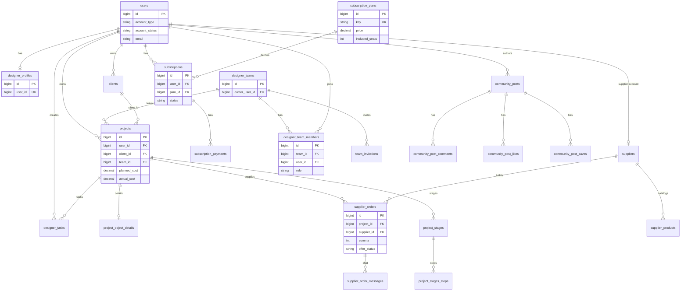

# ER Diagram

**Date:** 2026-08-03



## Account type vs team role

```
users.account_type     → designer | supplier | system_admin
designer_team_members.role → owner | admin | designer
```

Corporate administrator = team role `admin` with global type `designer`.
